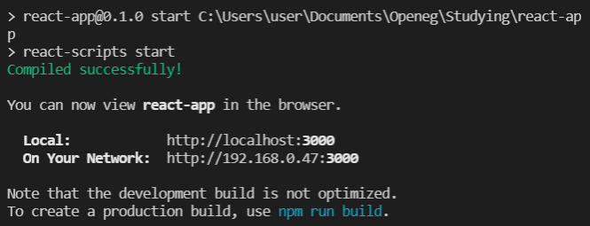
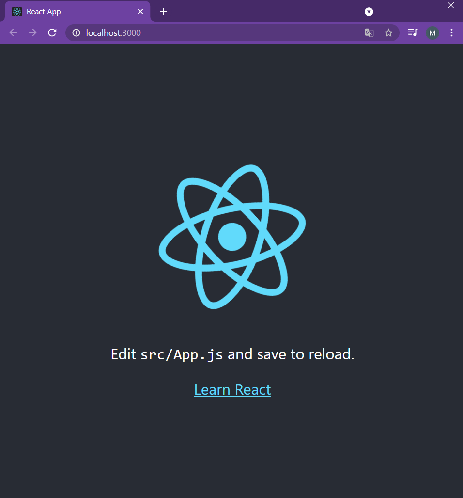
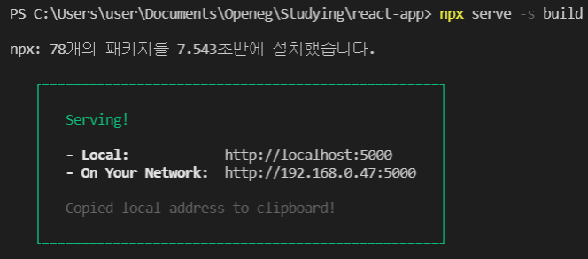
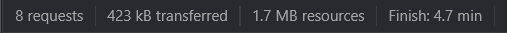
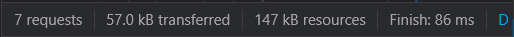
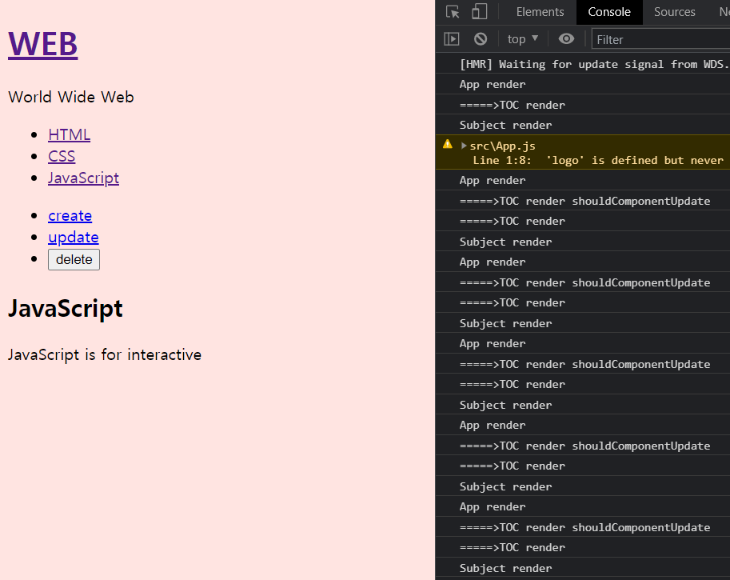
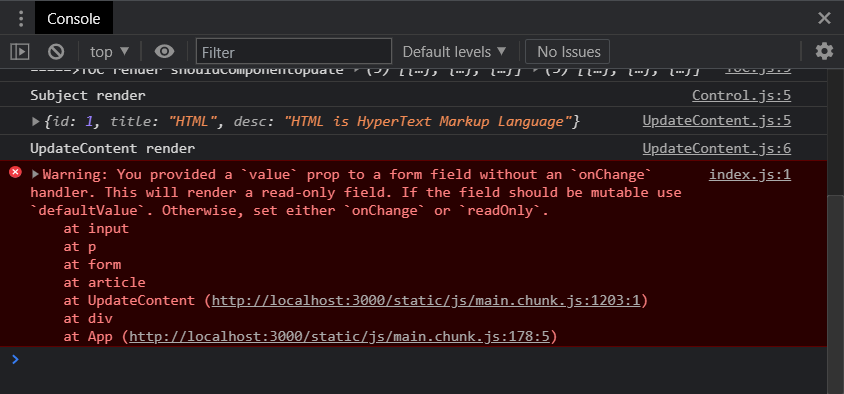
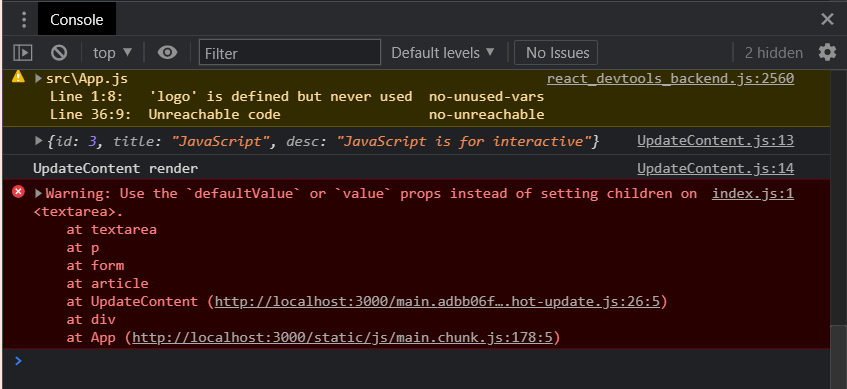

# React

> Facebook에서 만든 JS UI 라이브러리

## 1. 소개

- React의 특징
  - 사용자 정의 태그를 사용가능하게 해준다 ➡ `Component`
  - Component의 특징
    1. 코드의 가독성을 높여준다.
    2. 재사용성이 높다.
    3. 유지보수가 편리하다.

## 2. 개발환경 세팅

> [React 공식문서](https://ko.reactjs.org/)

### 2-1. 온라인 코드 편집기 사용

- [CodePen](https://codepen.io/pen?&editors=0010)
- [CodeSandbox](https://codesandbox.io/s/new)
- [StackBlitz](https://stackblitz.com/edit/react-cehpbc)

### 2-2. NPM을 사용해서 Create React App 설치

- NPM: Node.js를 사용한 앱 설치를 도와주는 프로그램

- 설치 순서

  1. [Node.js 설치](https://nodejs.org/ko/)

  2. Node.js 설치 확인

     ```shell
     C:\Users\user> node -v
     v14.17.0
     
     C:\Users\user> npm -v
     6.14.13
     ```

  3. Create React App 설치

     ```shell
     C:\Users\user> npm install -g create-react-app
     ```

     3-1. React 공식문서의 Create React App 설치 및 실행 방법

     ```shell
     npx create-react-app my-app
     cd my-app
     npm start
     ```

     - `npx`는 `npm`처럼 별도로 로컬 컴퓨터에 설치하지 않고 임시로 리액트 앱을 설치하여 사용 후 삭제되도록 하는 명령어
       - 장점
         - 항상 최신 버전 사용 가능
         - 간편하게 리액트 앱 사용 가능

  4. Create React App 설치 확인

     ```shell
     C:\Users\user> create-react-app -V
     4.0.3
     ```

### 2-3. Create React App을 이용한 개발환경 구축

1. 디렉토리로 지정해줄 새 폴더 생성

2. 생성한 폴더로 이동

   ```shell
   C:\Users\user> cd C:\Users\user\Documents\Openeg\Studying\react-app
   ```

3. `create-react-app` 명령어 실행

   ```shell
   C:\Users\user> create-react-app .
   ```

## 3. React 샘플 웹앱 실행

1. React 앱 실행

   ```powershell
   PS C:\Users\user\Documents\Openeg\Studying\react-app> npm run start
   ```

   - 정상적으로 실행되었을 때 - Terminal

     

   - 정상적으로 실행되었을 때 - 웹 브라우저

     

2. React 앱 종료

   > 종료 키 `ctrl + c`

## 4. React 앱 기본 구조 분석

### 4-1. index.html과 index.js

- `index.js`

  ```react
  import React from 'react';
  import ReactDOM from 'react-dom';
  import './index.css';
  import App from './App';
  import reportWebVitals from './reportWebVitals';
  
  ReactDOM.render(
    <React.StrictMode>
      <App />
    </React.StrictMode>,
    document.getElementById('root')
  );
  
  // If you want to start measuring performance in your app, pass a function
  // to log results (for example: reportWebVitals(console.log))
  // or send to an analytics endpoint. Learn more: https://bit.ly/CRA-vitals
  reportWebVitals();
  
  ```

  - `'root'`: `index.html`의 `<div>`태그 이름이다.

    ```html
    <body>
        <noscript>You need to enable JavaScript to run this app.</noscript>
        <div id="root"></div>
        <!--
          This HTML file is a template.
          If you open it directly in the browser, you will see an empty page.
    
          You can add webfonts, meta tags, or analytics to this file.
          The build step will place the bundled scripts into the <body> tag.
    
          To begin the development, run `npm start` or `yarn start`.
          To create a production bundle, use `npm run build` or `yarn build`.
        -->
     </body>
    ```

  - `<App />`: src 폴더 아래의 App.js를 말한다.

    - App.js를 함수에서 class로 변경하기

      ```react
      //function으로 선언되어 있을 때
      import logo from './logo.svg';
      import './App.css';
      
      function App() {
        return (
          <div className="App">
            <header className="App-header">
              
              <p>
                Edit <code>src/App.js</code> and save to reload.
              </p>
              <a
                className="App-link"
                href="https://reactjs.org"
                target="_blank"
                rel="noopener noreferrer"
              >
                Learn React
              </a>
            </header>
          </div>
        );
      }
      
      export default App;
      
      //class로 변경했을 때
      import logo from './logo.svg';
      import './App.css';
      import { Component } from 'react';
      
      class App extends Component {
        render() {
          return (
            <div className="App">
              <header className="App-header">
                
                <p>
                  Edit <code>src/App.js</code> and save to reload.
                </p>
                <a
                  className="App-link"
                  href="https://reactjs.org"
                  target="_blank"
                  rel="noopener noreferrer"
                >
                  Learn React
                </a>
              </header>
            </div>
          );
        }
      }
      
      export default App;
      ```

    - class로 변경 시 에러

      ```react
      TypeError: Class constructor App cannot be invoked without 'new'
      
      //해결방법: Component import가 잘 안 되어 있어서 발생한 에러로 import를 제대로 해 주면 된다.
      import { Component } from 'react';
      ```

### 4-2. index.css

- `index.css` 수정하기

  ```css
  body {
    background-color: mistyrose;
  }
  ```

## 5. 배포

### 5-1. React 웹앱 배포하는 방법

1. build하기

   ```powershell
   npm run build
   ```

   - 모듈을 찾지 못하는 에러

     ```powershell
     Failed to compile.
     
     Cannot find module 'vendors'
     Require stack:
     - C:\Users\user\Documents\Openeg\Studying\react-app\node_modules\postcss-merge-rules\dist\index.js
     - C:\Users\user\Documents\Openeg\Studying\react-app\node_modules\cssnano-preset-default\dist\index.js
     - C:\Users\user\Documents\Openeg\Studying\react-app\node_modules\cssnano\dist\index.js
     - C:\Users\user\Documents\Openeg\Studying\react-app\node_modules\optimize-css-assets-webpack-plugin\src\index.js
     - C:\Users\user\Documents\Openeg\Studying\react-app\node_modules\react-scripts\config\webpack.config.js
     - C:\Users\user\Documents\Openeg\Studying\react-app\node_modules\react-scripts\scripts\build.js
     
     
     npm ERR! code ELIFECYCLE
     npm ERR! errno 1
     npm ERR! react-app@0.1.0 build: `react-scripts build`
     npm ERR! Failed at the react-app@0.1.0 build script.
     npm ERR! This is probably not a problem with npm. There is likely additional logging outonal logging output above.
                                                                                             put above.
     npm ERR! A complete log of this run can be found in:
     npm ERR!     C:\Users\user\AppData\Roaming\npm-cache\_logs\2021-05-14T06_42_45_970Z-debu_42_45_970Z-debug.log
     
     #해당 모듈을 설치해주고 다시 빌드한다
     C:\Users\user\Documents\Openeg\Studying\react-app> npm i react vendors
     ```

2. `build`디렉토리 자동생성

   

3. 웹 서버 실행

   ```powershell
   PS C:\Users\user\Documents\Openeg\Studying\react-app> npx serve -s build
   ```

   - 결과

     

### 5-2. React 웹앱 build버전을 배포했을 때의 장점

- 용량이 줄어든다

  - 개발할 때의 용량

    

  - build버전을 배포했을 때의 용량

    

## 6. Component와 Props

### 6-1. 기본 Component 생성

1. `App.js`파일 안에 class 이름과 함께 Component 정의

   ```react
   class Subject extends Component {
     
   }
   ```

2. `render() {}` 함수 필수로 생성

   ```react
   class Subject extends Component {
     render() {
       
     }
   }
   ```

3. `return` 작성

   ```react
   class Subject extends Component {
     render() {
       return (
         <header>
             <h1>WEB</h1>
               World Wide WEB!!
         </header>
       );
     }
   }
   ```

### 6-2. Component의 특징

- `App.js`에서 `Component`를 생성하기 위해 작성한 코드는 JS가 아니라 JS와 유사해 보이는 **JSX**
- `Component`는 복잡도를 줄여준다.
- 배포된 `Component`를 다른 프로젝트에도 동일하게 사용할 수 있다.

### 6-3. Props 활용 방법

> Props는 속성(attribute)과 같은 역할을 한다.

```react
import logo from './logo.svg';
import './App.css';
import { Component } from 'react';

class Subject extends Component {
  render() {
    return (
      <header>
          <h1>{this.props.title}</h1>
            {this.props.sub}
      </header>
    );
  }
}

class TOC extends Component {
  render() {
    return (
      <nav>
          <ul>
              <li><a href="1.html">HTML</a></li>
              <li><a href="2.html">CSS</a></li>
              <li><a href="3.html">JavaScript</a></li>
          </ul>
      </nav>
    )
  }
}

class Content extends Component {
  render() {
    return (
      <article>
          <h2>{this.props.title}</h2>
          {this.props.desc}
      </article>
    )
  }
}

class App extends Component {
  render() {
    return (
      <div className="App">
          <Subject title="YAY" sub="React!"></Subject>
          <TOC></TOC>
          <Content title="HTML" desc="HTML is HyperText Markup Language."></Content>
      </div>
    );
  }
}

export default App;
```

- `props`는 확장성에 기여한다.

### 6-4. Component 분리

1. 새 JS 파일 생성

2. 새로 생성한 JS 파일에 class 작성

   ```react
   class TOC extends Component {
       render() {
         return (
           <nav>
               <ul>
                   <li><a href="1.html">HTML</a></li>
                   <li><a href="2.html">CSS</a></li>
                   <li><a href="3.html">JavaScript</a></li>
               </ul>
           </nav>
         )
       }
     }
   ```

3. `Component`를 import

   ```react
   import { Component } from 'react';
   
   class TOC extends Component {
       render() {
         return (
           <nav>
               <ul>
                   <li><a href="1.html">HTML</a></li>
                   <li><a href="2.html">CSS</a></li>
                   <li><a href="3.html">JavaScript</a></li>
               </ul>
           </nav>
         )
       }
     }
   ```

4. 해당 JS파일을 외부에서 사용할 수 있도록 export문 작성

   ```react
   import { Component } from 'react';
   
   class TOC extends Component {
       render() {
         return (
           <nav>
               <ul>
                   <li><a href="1.html">HTML</a></li>
                   <li><a href="2.html">CSS</a></li>
                   <li><a href="3.html">JavaScript</a></li>
               </ul>
           </nav>
         )
       }
     }
   
     export default TOC;
   ```

5. 분리한 Component를 사용할 JS파일에서 불러오는 코드 작성

   ```react
   import TOC from "./components/TOC";
   ```

## 7. State

### 7-1. props와 State

- props: Component의 속성을 조작해서 사용자에게 다르게 보여줄 수 있는 정보
- State: 사용자에게는 노출되지 않는 Component 내부에서 사용되는 정보
- Component 구현 시 State와 props는 철저히 분리하여 구현되어야 한다.

### 7-2. State 사용

```react
class App extends Component {
  constructor(props) {
    super(props);
    this.state = {
      subject:{title:'WEB', sub:'World Wide Web'}
    }
  }
  render() {
    return (
      <div className="App">
          <Subject title={this.state.subject.title} sub={this.state.subject.sub}></Subject>
          <TOC></TOC>
          <Content title="HTML" desc="HTML is HyperText Markup Language."></Content>
      </div>
    );
  }
}
```

- `constructor`: Component가 실행될 때 가장 먼저 실행되어서 초기화를 담당하는 함수
- 상위 Component인 App의 `this.state` 내부에서 설정한 props값을 해당 props값을 받아서 보여줄 하위 Component의 props값으로 지정해서 사용

### 7-2. 여러 개의 하위 Component에 State로 props값을 전달하는 경우

```react
class App extends Component {
  constructor(props) {
    super(props);
    this.state = {
      subject:{title:'WEB', sub:'World Wide Web'},
      contentsclass App extends Component {
  constructor(props) {
    super(props);
    this.state = {
      subject:{title:'WEB', sub:'World Wide Web'},
      contents:[
        {id:1, title:'HTML', desc:'HTML is HyperText Markup Language'},
        {id:2, title:'CSS', desc:'CSS is for design'},
        {id:3, title:'JavaScript', desc:'JavaScript is for interactive'}
      ]
    }
  }
  render() {
    return (
      <div className="App">
          <Subject title={this.state.subject.title} sub={this.state.subject.sub}></Subject>
          <TOC data={this.state.contents}></TOC>
          <Content title="HTML" desc="HTML is HyperText Markup Language."></Content>
      </div>
    );
  }
}
    }
  }
  render() {
    return (
      <div className="App">
          <Subject title={this.state.subject.title} sub={this.state.subject.sub}></Subject>
          <TOC></TOC>
          <Content title="HTML" desc="HTML is HyperText Markup Language."></Content>
      </div>
    );
  }
}
```

```react
class TOC extends Component {
    render() {
        var lists = [];
        var data = this.props.data
        var i = 0;
        while(i < data.length) {
            lists.push(<li><a href={"/content/"+data[i].id}>{data[i].title}</a></li>)
            i = i+1;
        }
      return (
        <nav>
            <ul>
                {lists}
            </ul>
        </nav>
      )
    }
  }
```

- 반복문을 이용해서 State 내부에 선언한 props값을 받아와서 보여줄 수 있다.

> 하지만 이 경우에는 에러없이 작동은 되지만, `Console`에서는 **Warning: Each child in a list should have a unique "key" prop.** 라는 경고문이 뜬다.

### 7-3. key

```react
class TOC extends Component {
    render() {
        var lists = [];
        var data = this.props.data
        var i = 0;
        while(i < data.length) {
            lists.push(<li key={data[i].id}><a href={"/content/"+data[i].id}>{data[i].title}</a></li>)
            i = i+1;
        }
      return (
        <nav>
            <ul>
                {lists}
            </ul>
        </nav>
      )
    }
  }
```

- 여러 개의 props값 목록을 가져오는 경우에는 유니크한 `key`값이 필요하다.

## 8. 이벤트

### 8-1. state와 props

```react
import { Component } from 'react';

class Subject extends Component {
    render() {
      return (
        <header>
            <h1><a href="/">{this.props.title}</a></h1>
              {this.props.sub}
        </header>
      );
    }
  }

  export default Subject;
```

- 이벤트를 설치하기 전에 이벤트를 설치할 컴포넌트를 수정해준다.

```react
this.state = {
	mode: "welcome",
	welcome: (title: "Welcome", desc: "Hello, React!")
}

render() {
    console.log('App render');
    var _title, _desc = null;
    if(this.state.mode === 'welcome') {
        _title = this.state.welcome.title;
        _desc = this.state.welcome.desc;
    } else if(this.state.mode === 'read') {
        _title = this.state.contents[0].title;
        _desc = this.state.contents[0].desc;
    }
    return {
        <div className="App">
            <Context title={_title} desc={_desc}></Context>
        </div>
	}
}
```

- `render()`
  - state의 값이나 props의 값이 바뀌면 해당 컴포넌트의 render() 함수가 호출된다. = 화면이 다시 그려진다!
  - 여기에서는 state의 mode 값에 따라 화면을 달라지게 할 수 있다.

### 8-2. 이벤트 설치

- JS문법

  ```javascript
  <a href='/' onclick=""></a>
  ```

- 리액트문법

  ```react
  <a href='/' onClick={}></a>
  ```

- `debugger`: 개발자도구 - Sources에서 소스코드 확인하면서 디버그 가능

- 이벤트 동작 시 자동으로 새로고침을 방지하는 방법 (기본 동작 방지)

  - `preventDefault()` 사용하기

    ```react
    <header>
        <h1><a href="/" onClick={function(e) {
                    console.log(e);
                    e.preventDefault();
        }}>{this.state.subject.title}></a></h1>
        {this.state.subject.sub}
    </header>
    ```

- 이벤트에서 `state` 변경 방법

  - 리액트는 JS와 다르게 바로 `this.state.mode = 'welcome';`으로 코딩하면 동작하지 않는다.

  1. 함수 끝에 `.bind(this)`를 붙인다.
  2. 함수 안에서 `this.setState({})`를 사용한다.

  ```react
  <header>
      <h1><a href="/" onClick={function(e) {
                  console.log(e);
                  e.preventDefault();
                  this.setState({
                  	mode: 'welcome'
                  })
      }.bind(this)}>{this.state.subject.title}></a></h1>
      {this.state.subject.sub}
  </header>
  ```


### 8-3. 이벤트에서 사용하는 함수 이해하기

#### 1. bind() 함수

- `bind(this)`함수 사용 이유

  > render함수 안에서 `this`는 컴포넌트를 가리키지만, 이벤트에서 `this`는 아무것도 가리키지 않는다. 따라서 bind()함수로 바인딩해주어야 한다.

#### 2. setState() 함수

- `setState()`함수 사용 이유

  > 생성자 안에서 state값을 변경하는 것은 가능하다. 하지만 render()함수에서 동적으로 state값을 변경할 때 setState() 함수가 아니라 `this.state.mode = 'welcome';`과 같이 코딩하면 리액트는 state값 변경을 인지하지 못해서 렌더링이 되지 않는다. 따라서 state값을 변경하려면 setState() 함수를 이용해서 객체 또는 함수를 전달해야 리액트가 인지하고 렌더링이 된다.

### 8-4. 컴포넌트에 이벤트 적용하기

```react
<Subject
	title={this.state.subject.title}
	sub={this.state.subject.sub}
	onChangePage={function() {
		this.setState({
            mode: 'welcome'
        })
	}.bind(this)}>
</Subject>
```

- `App.js`의 `Subject`컴포넌트 영역에 `onChangePage`를 이용하여 이벤트 함수 생성
  - `onChangePage`이벤트는 `Subject`컴포넌트에 **`props`**형태로 전달된다!

```react
import { Component } from 'react';

class Subject extends Component {
    render() {
      return (
        <header>
            <h1><a href="/" onClick={function(e) {
              e.preventDefault();
              this.props.onChangePage();
            }.bind(this)}>{this.props.title}</a></h1>
              {this.props.sub}
        </header>
      );
    }
  }

  export default Subject;
```

- `Subject.js`에서 `onClick`으로 이벤트 함수를 생성하고 **`props`**형태로 전달된 `onChangePage`함수를 적용한다.

#### 1. 속성을 이용한 이벤트 처리

```react
import logo from './logo.svg';
import './App.css';
import TOC from "./components/TOC";
import Content from "./components/Content";
import Subject from "./components/Subject";
import { Component } from 'react';

class App extends Component {
  constructor(props) {
    super(props);
    this.state = {
      mode: 'read',
      // 기본으로 지정하는 id값
      selected_content_id: 1,
      welcome: {title:'Welcome', desc:'Hello, React!'},
      subject:{title:'WEB', sub:'World Wide Web'},
      contents:[
        {id:1, title:'HTML', desc:'HTML is HyperText Markup Language'},
        {id:2, title:'CSS', desc:'CSS is for design'},
        {id:3, title:'JavaScript', desc:'JavaScript is for interactive'}
      ]
    }
  }
  render() {
    console.log('App render');
    var _title, _desc = null;
    if(this.state.mode === 'welcome') {
      _title = this.state.welcome.title;
      _desc = this.state.welcome.desc;
    } else if(this.state.mode === 'read') {
      // while을 이용한 id값 통제
      var i = 0;
      while(i < this.state.contents.length) {
        var data = this.state.contents[i]
        if(data.id === this.state.selected_content_id) {
          _title = data.title;
          _desc = data.desc;
          break;
        }
        i = i + 1;
      }
    }
    return (
      <div className="App">
          <Subject
            title={this.state.subject.title}
            sub={this.state.subject.sub}
            onChangePage={function() {
              this.setState({
                mode: 'welcome'
              })
            }.bind(this)}>
          </Subject>
          <TOC
            onChangePage={function(id) {
              this.setState({
                // 기본 mode는 read로 해두고, string형식인 id값을 숫자형식으로 변경해준다.
                mode: 'read',
                selected_content_id: Number(id)
              })
            }.bind(this)} data={this.state.contents}></TOC>
          <Content title={_title} desc={_desc}></Content>
      </div>
    );
  }
}

export default App;
```

- `App.js`에서 이벤트 처리를 위한 코드를 작성해준다.

```react
import { Component } from 'react';

class TOC extends Component {
    render() {
        var lists = [];
        var data = this.props.data
        var i = 0;
        while(i < data.length) {
            lists.push(<li key={data[i].id}>
              <a
                href={"/content/"+data[i].id}
                data-id = {data[i].id}
                onClick={function(e) {
                  e.preventDefault();
                  // 이벤트의 target 속성은 a링크를 가리키고, target 속성 안의 dataset 속성에는 id값이 있다. id값을 가져오도록 하는 코드 작성.
                  this.props.onChangePage(e.target.dataset.id);
                }.bind(this)}>{data[i].title}</a></li>)
            i = i+1;
        }
      return (
        <nav>
            <ul>
                {lists}
            </ul>
        </nav>
      )
    }
  }

  export default TOC;
```

- `TOC.js`에서 이벤트 함수(e)의 속성 중에는 `target`이 있고, `target` 안에 `dataset`이라는 속성이 있다. 그 안에 `id`값이 표시된다.
- `onChangePage()`함수 안에 이벤트 함수의 속성에서 `id`값을 가져올 수 있도록 하는 코드 `e.target.dataset.id`를 넣어준다.

#### 2. `bind()`의 매개변수로 하는 이벤트 처리

```react
import { Component } from 'react';

class TOC extends Component {
    render() {
        var lists = [];
        var data = this.props.data
        var i = 0;
        while(i < data.length) {
            lists.push(<li key={data[i].id}>
              <a
                href={"/content/"+data[i].id}
                onClick={function(id, e) {
                  e.preventDefault();
                  this.props.onChangePage(id);
                }.bind(this, data[i].id)}>{data[i].title}</a></li>)
            i = i+1;
        }
      return (
        <nav>
            <ul>
                {lists}
            </ul>
        </nav>
      )
    }
  }

  export default TOC;
```

- `onClick`이벤트의 함수 안에서 `id`값을 매개변수로 받아서 처리할 수 있게 해준다.
- `bind()`함수 안에도 받아올 `id`를 매개변수로 넣어주어야 한다.

## 9. 복습

### props와 state의 차이점

- `props`
  - 읽기 전용(read-only)
  - 컴포넌트 외부에서 컴포넌트의 속성을 조작할 수 있는 정보
- `state`
  - 컴포넌트 내부에서 사용되는 정보
  - 값을 바꿀 수 있다

### 상위 컴포넌트의 속성을 조작할 때와 하위 컴포넌트의 속성을 조작할 때 차이점

- 상위 컴포넌트에서 하위 컴포넌트의 속성을 조작할 때

  - `props`로 속성값을 전달하여 조작 가능

- 하위 컴포넌트에서 상위 컴포넌트의 속성을 조작할 때

  - 리액트는 하향식(top-down) 단방향 데이터 흐름을 갖고 있으므로 하위 컴포넌트에서 상위 컴포넌트로 `props` 전달을 통한 속성 조작 불가

  - 이벤트 동작을 통해 상위 컴포넌트의 `state`를 조작하는 것은 가능

    ```react
    <TOC
        onChangePage={function(id) {
            this.setState({
                mode: 'read',
                selected_content_id: Number(id)
            })
        }.bind(this)} data={this.state.contents}>
    </TOC>
    // App 컴포넌트 안에 TOC 컴포넌트에서 이벤트 동작을 통해 setState로 App 컴포넌트의 속성(state)을 변경할 수 있다.
    ```

## 10. create구현

- CRUD 중 C, U, D 구현
  - `create`, `update`, `delete`라는 이름의 리스트를 만들어서 클릭하면 `App.js`의 `state`의 `mode`값을 변경하여 각 기능을 실행할 수 있도록 구현한다. 

### 10-1. mode변경 기능

- 컴포넌트 하나를 새로 생성하여 이벤트 동작을 통해 `mode`를 변경할 수 있도록 한다.

  ```react
  import { Component } from 'react';
  
  class Control extends Component {
      render() {
          console.log('Subject render')
        return (
          <ul>
              <li><a href="/create" onClick={function(e) {
                  e.preventDefault();
                  this.props.onChangeMode('create');
              }.bind(this)}>create</a></li>
              <li><a href="/update" onClick={function(e) {
                  e.preventDefault();
                  this.props.onChangeMode('update');
              }.bind(this)}>update</a></li>
              <li><input onClick={function(e) {
                  e.preventDefault();
                  this.props.onChangeMode('delete');
              }.bind(this)} type="button" value="delete"></input></li>
          </ul>
        )
      }
    }
  
    export default Control;
  ```

  ```react
  <Control onChangeMode={function(_mode) {
          this.setState({
              mode: _mode
          })
      }.bind(this)}>
  </Control>
  ```

### 10-2. mode 전환 기능

- 리스트를 클릭할 때 이벤트 동작으로 바뀐 `mode`마다 다른 컨텐츠 내용이 표시될 수 있도록 한다.

  ```react
  render() {
      console.log('App render');
      // 컨텐츠 영역에 표시할 _article도 정의해준다.
      var _title, _desc, _article = null;
      if(this.state.mode === 'welcome') {
        _title = this.state.welcome.title;
        _desc = this.state.welcome.desc;
        _article = <ReadContent title={_title} desc={_desc}></ReadContent>
      } else if(this.state.mode === 'read') {
        // while을 이용한 id값 통제
        var i = 0;
        while(i < this.state.contents.length) {
          var data = this.state.contents[i]
          if(data.id === this.state.selected_content_id) {
            _title = data.title;
            _desc = data.desc;
            break;
          }
          i = i + 1;
        }
        _article = <ReadContent title={_title} desc={_desc}></ReadContent>
      } else if(this.state.mode === 'create') {
        _article = <CreateContent></CreateContent>
      }
      return (
        <div className="App">
            <Subject
              title={this.state.subject.title}
              sub={this.state.subject.sub}
              onChangePage={function() {
                this.setState({
                  mode: 'welcome'
                })
              }.bind(this)}>
            </Subject>
            <TOC
              onChangePage={function(id) {
                this.setState({
                  // 기본모드는 read로 해두고, string형식인 id값을 숫자형식으로 변경해준다.
                  mode: 'read',
                  selected_content_id: Number(id)
                })
              }.bind(this)} data={this.state.contents}></TOC>
            <Control onChangeMode={function(_mode) {
              this.setState({
                mode: _mode
              })
            }.bind(this)}></Control>
            {/* 컨텐츠 영역에 표시할 내용을 변수로 지정 */}  
            {_article}
        </div>
      );
    }
  ```

- `CreateContent` 컴포넌트를 생성해서 제목과 내용을 입력할 수 있는 Form을 만든다.

  - `Form`은 기본적인 생성방식과 똑같이 생성
  - `onSubmit` 이벤트를 사용해서 양식을 제출했을 때 페이지가 새로고침되지 않도록 `preventDefault()`함수를 적용하고 `props`값으로 제목과 내용을 전달할 수 있도록 한다.

  ```react
  import { Component } from 'react';
  
  class CreateContent extends Component {
      render() {
        return (
          <article>
              <h2>Create</h2>
              <form action="/create_process" method="post" 
              onSubmit={function(e) {
                  e.preventDefault();
                  this.props.onSubmit(
                      e.target.title.value,
                      e.target.desc.value
                  );
                  alert('Submit!')
              }.bind(this)}
              >
                  <p>
                      <input type="text" name="title" placeholder="title"></input></p>
                  <p>
                      <textarea name="desc" placeholder="description"></textarea>
                  </p>
                  <p>
                      <input type="submit"></input>
                  </p>
              </form>
          </article>
        );
      }
    }
  
    export default CreateContent;
  ```

### 10-3. contents 변경

- 배열을 이용하기 위한 준비: `contents` 배열의 마지막 `id`값을 변수로 지정한다.

  ```react
  constructor(props) {
      super(props);
      // contents의 마지막 id값을 변수로 지정
      this.max_content_id = 3;
      this.state = {
        mode: 'create',
        // 기본으로 지정하는 id값
        selected_content_id: 1,
        welcome: {title:'Welcome', desc:'Hello, React!'},
        subject:{title:'WEB', sub:'World Wide Web'},
        contents:[
          {id:1, title:'HTML', desc:'HTML is HyperText Markup Language'},
          {id:2, title:'CSS', desc:'CSS is for design'},
          {id:3, title:'JavaScript', desc:'JavaScript is for interactive'}
        ]
      }
    }
  ```

- 원본 배열을 직접 변경하는 경우

  > ❗`push`를 이용해서 원본 배열을 직접 변경하는 경우에는 react의 성능 개선(유지보수)에 좋지 않다.

  ```react
  else if(this.state.mode === 'create') {
        _article = <CreateContent onSubmit={function(_title, _desc) {
          // add content to this.state.contents
          this.max_content_id = this.max_content_id + 1;;
          this.state.contents.push(
            { id: this.max_content_id, title: _title, desc: _desc });
          this.setState({
            contents: this.state.contentss
          })
          console.log(_title, _desc);
        }.bind(this)}></CreateContent>
      }
  ```

- `concat()`을 이용하는 경우

  > 원본 배열을 변경하지 않으므로 권장하는 방법

  ```react
  else if(this.state.mode === 'create') {
        _article = <CreateContent onSubmit={function(_title, _desc) {
          // add content to this.state.contents
          this.max_content_id = this.max_content_id + 1;;
          // push()를 사용한 원본 배열 변경은 권장하지 않음.
          // this.state.contents.push(
          //   { id: this.max_content_id, title: _title, desc: _desc });
          var _contents = this.state.contents.concat(
            { id: this.max_content_id, title: _title, desc: _desc }
          )
          this.setState({
            contents: _contents
          })
          console.log(_title, _desc);
        }.bind(this)}></CreateContent>
      }
  ```

#### 📌 push()와 concat()의 차이

- `push()`: 원본 배열에 데이터값을 추가

  ```react
  var arr = [1,2]
  arr.push(3)
  arr
  > (3) [1, 2, 3]
  ```

- `concat()`: 원본 배열에 데이터값 추가하지 않고, 변수를 사용하여 새로운 변수에 변경된 데이터값을 저장할 수 있음

  ```react
  var arr2 = [1,2]
  arr2.concat(3)
  arr2
  > (2) [1, 2]
  
  var result = arr2.concat(3)
  result
  > (3) [1, 2, 3]
  ```

### 10-4. shouldComponentUpdate()

- 불필요하게 화면이 렌더링되어 성능 저하를 일으키지 않게 하기 위해 사용하는 함수

  - 리액트에서는 부모 컴포넌트가 렌더링될 때마다 자식 컴포넌트도 렌더링된다.

  - 예) 각 리스트를 클릭할 때마다 `TOC`컴포넌트가 불필요하게 렌더링되는 경우

    

- 특징

  - `newProps`와 `newState`라는 2개의 매개변수를 가진다.

  ```react
  shouldComponentUpdate(newProps, newState) {
      console.log('=====>TOC render shouldComponentUpdate'
                 ,newProps.data
                 ,this.props.data);
      return false;
  }
  ```

  ```react
  =====>TOC render shouldComponentUpdate
  // 새로운 props값 출력
  (4) [{…}, {…}, {…}, {…}]
  0: {id: 1, title: "HTML", desc: "HTML is HyperText Markup Language"}
  1: {id: 2, title: "CSS", desc: "CSS is for design"}
  2: {id: 3, title: "JavaScript", desc: "JavaScript is for interactive"}
  3: {id: 4, title: "React", desc: "React is for UI"}
  length: 4
  __proto__: Array(0)
  
  // 기존의 props값 출력
  (3) [{…}, {…}, {…}]
  0: {id: 1, title: "HTML", desc: "HTML is HyperText Markup Language"}
  1: {id: 2, title: "CSS", desc: "CSS is for design"}
  2: {id: 3, title: "JavaScript", desc: "JavaScript is for interactive"}
  length: 3
  __proto__: Array(0)
  ```

- `return`값이 `true`일 때 `render()`함수를 호출하고, `false`일 때는 `render()`함수를 호출하지 않는다.

  ```react
  shouldComponentUpdate(newProps, newState) {
        console.log('=====>TOC render shouldComponentUpdate'
          ,newProps.data
          ,this.props.data
        );
        if(this.props.data === newProps.data) {
          return false;
        }
        return true;
  }
  ```

  ```react
  // props값이 바뀌지 않았을 때
  App render
  TOC.js:5 =====>TOC render shouldComponentUpdate (3) [{…}, {…}, {…}] undefined
  Control.js:5 Subject render
  App.js:29 App render
  TOC.js:5 =====>TOC render shouldComponentUpdate (3) [{…}, {…}, {…}] undefined
  Control.js:5 Subject render
  App.js:29 App render
  TOC.js:5 =====>TOC render shouldComponentUpdate (3) [{…}, {…}, {…}] undefined
  Control.js:5 Subject render
  App.js:29 App render
  TOC.js:5 =====>TOC render shouldComponentUpdate (3) [{…}, {…}, {…}] undefined
  Control.js:5 Subject render
  
  // props값이 바뀌었을 때
  App.js:62 React React is for UI
  App.js:29 App render
  // render()함수 호출
  =====>TOC render shouldComponentUpdate (4) [{…}, {…}, {…}, {…}] (3) [{…}, {…}, {…}]
  TOC.js:15 =====>TOC render
  Control.js:5 Subject render
  ```

> 📌 이때 push()를 사용하면 원본인 `this.props.data`가 바뀌기 때문에 `shouldComponentUpdate()`함수의 if문이 작동해서 데이터가 바뀌었음에도 `TOC`컴포넌트는 새로 렌더링이 되지 않는 문제가 발생한다. 따라서 원본 데이터를 바꾸지 않는 `concat()` 함수를 사용하는 것을 권장한다.

### 10-5. immutable

#### 리액트의 불변성

> 리액트의 컴포넌트는 불변성을 가져야 한다.

- 불변성의 장점
  1. 함수에서 side effect가 발생할 확률이 줄어든다.
  2. 동기화 문제에서 자유롭다.
  3. 컴포넌트 최적화가 가능하다.

📌 리액트의 불변성을 위한 자바스크립트 라이브러리인 immutable.js 사용에 대해 [알아보기](https://immutable-js.github.io/immutable-js/)

## 11. Update 구현

### 11-1. Update 기능 구현을 위한 준비

1. `CreateContent` 컴포넌트 내용을 복사해서 `UpdateContent` 컴포넌트 파일 생성

2. `App.js`에서 `render()`함수 내용이 길어져서 보기 힘들어졌으므로 컨텐츠의 `id`값을 통제하는 부분과 컨텐츠 내용을 가져오는 부분을 생성자(`constructor()`) 함수 안으로 분리해서 넣기

   - `getReadContent()`

     ```react
     getReadContent() {
         // while을 이용한 id값 통제
         var i = 0;
         while(i < this.state.contents.length) {
           var data = this.state.contents[i]
           if(data.id === this.state.selected_content_id) {
             return data;
             break;
           }
           i = i + 1;
         }
       }
     ```

   - `getContent()`

     ```react
     getContent() {
         // 컨텐츠 영역에 표시할 _article도 정의해준다.
         var _title, _desc, _article = null;
         if(this.state.mode === 'welcome') {
           _title = this.state.welcome.title;
           _desc = this.state.welcome.desc;
           _article = <ReadContent title={_title} desc={_desc}></ReadContent>
         } else if(this.state.mode === 'read') {
           var _content = this.getReadContent();
           _article = <ReadContent title={_content.title} desc={_content.desc}></ReadContent>
         } else if(this.state.mode === 'create') {
           _article = <CreateContent onSubmit={function(_title, _desc) {
             // add content to this.state.contents
             this.max_content_id = this.max_content_id + 1;;
             // push()를 사용한 원본 배열 변경은 권장하지 않음.
             // this.state.contents.push(
             //   { id: this.max_content_id, title: _title, desc: _desc });
             // var _contents = this.state.contents.concat(
             //   { id: this.max_content_id, title: _title, desc: _desc }
             // )
             var newContents = Array.from(this.state.contents)
             newContents.push({id:this.max_content_id, title:_title, desc:_desc})
             this.setState({
               // contents: _contents
               contents: newContents
             })
             console.log(_title, _desc);
           }.bind(this)}></CreateContent>
         } else if(this.state.mode === 'update') {
           _content = this.getReadContent();
           _article = <UpdateContent data={_content} onSubmit={function(_title, _desc) {
             // add content to this.state.contents
             this.max_content_id = this.max_content_id + 1;;
             // push()를 사용한 원본 배열 변경은 권장하지 않음.
             // this.state.contents.push(
             //   { id: this.max_content_id, title: _title, desc: _desc });
             // var _contents = this.state.contents.concat(
             //   { id: this.max_content_id, title: _title, desc: _desc }
             // )
             var newContents = Array.from(this.state.contents)
             newContents.push({id:this.max_content_id, title:_title, desc:_desc})
             this.setState({
               // contents: _contents
               contents: newContents
             })
             console.log(_title, _desc);
           }.bind(this)}></UpdateContent>
         }
         return _article;
     ```

3. `render()`함수 안의 컨텐츠 호출 부분 수정하기

   ```react
   {/* 컨텐츠 영역에 표시할 내용을 변수로 지정 */}
   {this.getContent()}
   ```

### 11-2. Update Form 구현하기

- 수정할 `input value`값 가져오기

  ⚠ `input value`값을 `props`로 가져오면 경고 및 값 변경이 불가능한 오류 발생

  ```react
  <p>
      <input type="text" name="title" placeholder="title" value={this.props.data.title}></input>
  </p>
  ```

  

  > 👉 `props`값은 **Read-only**이므로 `onChange` 핸들러를 같이 사용하지 않으면 값을 변경할 수 없다는 경고가 뜬다. 따라서 `props`값을 변경할 수 있는 `state`값으로 가져와서 변경해야 한다.

  **❗ `input value`값은 `state`값으로 가져오고 `onChange`핸들러를 추가해 준다.**

  ```react
  // value값에 바로 this.props.data.title을 넣으면 props는 read-only값이라 값을 변경하지 못하므로 생성자로 props를 state로 받아서 value를 state값으로써 바꿀 수 있게 해준다.
      constructor(props) {
          super(props);
          this.state = {
              title: this.props.data.title,
              desc: this.props.data.desc
          }
      }
      inputFormHandler(e) {
          this.setState({title: e.target.value});
      }
  ```

  ```react
  <p>
      <input type="text" name="title" placeholder="title" value={this.state.title} onChange={function(e) {
                          this.setState({title: e.target.value});
          }.bind(this)}></input>
  </p>
  ```

- 수정할 `textarea`의 내용 `state`로 가져오기

  ⚠ `textarea value`로 가져오지 않으면 경고 발생

  ```react
  <p>
      <textarea name="desc" placeholder="description">{this.state.desc}</textarea>
  </p>
  ```

  

  >👉 `defaultValue` 또는 `value`값을 설정해줘야 한다는 경고가 뜬다. `input value`를 설정해준 것처럼 `textarea` 태그 안에 `value`로 `state`값을 가져오고 `onChange`핸들러를 설정해줘야 한다.

  **❗ `textarea value`값을 `state`값으로 가져오고 `onChange`핸들러를 추가해 준다.**

  ```react
  <p>
      <textarea name="desc" placeholder="description" value={this.state.desc} onChange={function(e) {
                          this.setState({desc: e.target.value});
                      }.bind(this)}></textarea>
  </p>
  ```

- 공통으로 사용되는 `bind(this)`를 따로 빼주고, `title`와 `desc` 각각에 따라 `onChange`핸들러가 동작하도록 변경하기

  ```react
  import { Component } from 'react';
  
  class UpdateContent extends Component {
      // value값에 바로 this.props.data.title을 넣으면 props는 read-only값이라 값을 변경하지 못하므로 생성자로 props를 state로 받아서 value를 state값으로써 바꿀 수 있게 해준다.
      constructor(props) {
          super(props);
          this.state = {
              title: this.props.data.title,
              desc: this.props.data.desc
          }
          // 공통으로 사용되는 bind(this)를 넣은 값을 변수로 빼준다.
          this.inputFormHandler = this.inputFormHandler.bind(this);
      }
      inputFormHandler(e) {
          // [e.target.name]으로 title과 desc값을 각각 변경할 수 있다.
          this.setState({[e.target.name]: e.target.value});
      }
      render() {
          console.log(this.props.data);
          console.log('UpdateContent render')
        return (
          <article>
              <h2>Update</h2>
              <form action="/update_process" method="post" 
              onSubmit={function(e) {
                  e.preventDefault();
                  this.props.onSubmit(
                      e.target.title.value,
                      e.target.desc.value
                  );
              }.bind(this)}
              >
                  <p>
                      <input type="text" name="title" placeholder="title" value={this.state.title} onChange={this.inputFormHandler}></input>
                  </p>
                  <p>
                      <textarea name="desc" placeholder="description" value={this.state.desc} onChange={this.inputFormHandler}></textarea>
                  </p>
                  <p>
                      <input type="submit"></input>
                  </p>
              </form>
          </article>
        );
      }
    }
  
    export default UpdateContent;
  ```

### 11-3. Update 구현 마무리 - state 변경

- 컨텐츠의 `id`값을 가져오는 코드를 `UpdateContent` 컴포넌트에 추가하기

  ```react
  return (
      <article>
          <h2>Update</h2>
          <form action="/update_process" method="post" 
              onSubmit={function(e) {
                  e.preventDefault();
                  this.props.onSubmit(
                      this.state.id,
                      this.state.title,
                      this.state.desc
                  );
              }.bind(this)}
              >
              {/* id값을 가져오는 코드 추가 */}
              <input type="hidden" name="id" value={this.state.id}></input>
  ```

- `App.js`에서 컨텐츠의 `id`값을 기준으로 해당 `id`값을 가진 컨텐츠 내용을 수정하여 배열에 반영하도록 하기

  ```react
  else if(this.state.mode === 'update') {
        _content = this.getReadContent();
        _article = <UpdateContent data={_content} onSubmit={function(_id, _title, _desc) {
          // push()를 사용한 원본 배열 변경은 권장하지 않음.
          // this.state.contents.push(
          //   { id: this.max_content_id, title: _title, desc: _desc });
          // var _contents = this.state.contents.concat(
          //   { id: this.max_content_id, title: _title, desc: _desc }
          // )
          // 업데이트할 컨텐츠의 id값을 이용해서 해당 id를 가진 컨텐츠를 배열에서 업데이트
          var _contents = Array.from(this.state.contents);
          var i = 0;
          while(i < _contents.length) {
            if(_contents[i].id === _id) {
              _contents[i] = {id: _id, title: _title, desc: _desc};
              break;
            }
            i = i + 1;
          }
          this.setState({
            contents: _contents
          })
        }.bind(this)}></UpdateContent>
      }
  ```

- `App.js`에서 `update` 기능 동작 후에 모드를 `read`로 바로 변경해주는 코드 추가

  ```react
  this.setState({
      contents: _contents,
      mode: 'read'
  });
  ```

- `App.js`에서 `create` 기능 동작 후에 모드를 `read`로 바로 변경해주는 코드와 컨텐츠 배열의 맨 마지막 `id`값을 변경해주는 코드 추가

  ```react
  this.setState({
      contents: _contents,
      mode: 'read',
      selected_content_id: this.max_content_id
  });
  ```

## 12. Delete 구현

- `App.js`에 있는 `Control`컴포넌트 부분에서 `delete`기능을 수행하도록 구현할 수 있다.

- `delete`모드일 때와 아닐 때 구분 짓는 코드로 수정하기

  ```react
  <Control onChangeMode={function(_mode) {
          if(_mode === 'delete') {
              
          } else {
              this.setState({
                  mode: _mode
              });
          }
      }.bind(this)}></Control>
  ```

- `delete`모드에서 `confirm`창을 띄우고 사용자가 확인을 누르면 삭제하고, 취소를 누르면 삭제하지 않도록 하는 코드 작성하기

  ```react
  <Control onChangeMode={function(_mode) {
          if(_mode === 'delete') {
              // confirm은 앞에 window를 붙여줘야 실행된다
              if(window.confirm('Really?')) {
                  // 원본 배열을 직접 수정하지 않게 하기
                  var _contents = Array.from(this.state.contents);
                  var i = 0;
                  while(i < _contents.length) {
                      if(_contents[i].id === this.state.selected_content_id) {
                          // splice()로 어디에서 어디까지 지울 것인지 결정
                      	_contents.splice(i,1);
                      	break;
                      }
                    	i = i + 1;
                  }
                  this.setState({
                    mode: 'welcome',
                    contents: _contents
                  });
                  alert('Deleted!');
              }
          } else {
              this.setState({
                  mode: _mode
              });
          }
      }.bind(this)}></Control>
  ```

  >💡 `splice()`: 배열을 변경할 때 사용하는 함수. `()`안에 들어가는 인자는 순서대로 1. 변경을 시작할 인덱스, 2. 제거할 요소의 개수, 3. 배열에 추가할 요소 3가지이다. 리턴값은 제거한 요소를 담은 배열이다.

## 13. 마무리

- React의 불변성
  - 배열과 객체는 불변성을 가진다.
  - 프로젝트가 고도화되고 복잡해질수록 원본 배열이나 객체, 값을 쉽게 수정할 수 있으면 심각한 이슈가 발생할 수도 있다.
  - 쉽게 원본 데이터를 변경하지 않고 원본 데이터를 복제해서 사용하도록 하여 심각한 이슈 발생을 사전에 방지하도록 해야 한다.

> 📌 [immutable.js 알아보기](https://immutable-js.github.io/immutable-js/)

- Router

  - 하나의 url로 이루어진 싱글 페이지 웹 애플리케이션(SPA)의 장단점

    - 장점: 페이지를 전환할 때마다 네트워크를 새로 로딩하지 않아도 된다.
    - 단점: url이 하나이기 때문에 특정 페이지를 찾아가기 힘들다.

    👉 다른 url을 사용하여 각 url마다 다른 UI가 보여지도록 할 수 있지만(MPA), 그렇게 여러 개의 화면을 띄우면 JS의 비중이 커지면서 그에 따른 단점이 생긴다.

  - 써드파티인 `React Router`처럼 라우팅을 해주는 라이브러리를 이용해서 각 url에 따른 페이지를 맞게 렌더링해줄 수 있다.

> 📌 [React Router 알아보기](https://reactrouter.com/)

- `npm run eject` 사용
  - `create-react-app`의 숨겨진 설정을 보고 수정할 수 있게 해주는 명령어
  - 한 번 `eject`를 하면 다시 원래대로 돌아갈 수 없다.
- Redux
  - 중앙에 저장소 하나를 생성하여 저장소에 모든 컴포넌트를 직접 연결시켜 저장소의 데이터를 변경하면 해당 데이터와 연관된 모든 컴포넌트에 영향을 미칠 수 있게 해준다.
- React Server Side Rendering
  - 서버 쪽에서 웹 애플리케이션을 만들어서 클라이언트 쪽으로 전송하는 방식으로 웹 애플리케이션을 구동할 수 있게 해준다.
  - 장점
    - 개발 시간 단축
    - 자바스크립트 애플리케이션의 특성인 로딩이 필요없다는 점을 유지할 수 있음
    - `robot`에 친화적
- React Native
  - 모바일 애플리케이션과 웹 애플리케이션을 모두 만들 수 있다.


