# React: class vs. function

## 1. 소개

- class 컴포넌트
  - `React.Component`와 `React.PureComponent`를 기반으로 만든 컴포넌트를 말한다.
  - Life-cycle method를 사용하여 `state`값이 바뀌면 렌더링을 다시 한다.
  - 클래스 스타일로 만드는 컴포넌트는 함수 스타일 컴포넌트보다 여러가지 문법이나 관련 지식이 상대적으로 더 많이 필요하다.
- function 컴포넌트
  - `state`와 Life-cycle method 사용이 불가능하다.
  - 함수를 만드는 문법만 알고 있으면 만들 수 있다.

> 👉 **`hooks`**의 등장으로 함수 스타일 컴포넌트도 `state`와 Life-cycle method 사용이 가능해졌다!

## 2. 개발환경 세팅

### 2-1. React app 설치

```powershell
PS C:\Studying\react-class-vs-function> npx create-react-app .
```

### 2-2. React app 실행

```powershell
npm start
```

### 2-3. Class Component와 Function Component 세팅

- `App.js`

  ```react
  import React from 'react';
  import './App.css';
  
  function App() {
    return (
      <div className="container">
        <h1>Hello World!</h1>
        <FuncComp></FuncComp>
        <ClassComp></ClassComp>
      </div>
    );
  }
  // Function Component
  function FuncComp() {
    return (
      <div className="containter">
        <h2>Function style component</h2>
      </div>
    )
  }
  //Class Component
  class ClassComp extends React.Component {
    render() {
      return (
        <div className="container">
          <h2>Class style component</h2>
        </div>
      )
    }
  }
  export default App;
  ```

- `App.css`

  ```css
  .container {
      border: 5px solid red;
      margin: 5px;
      padding: 5px;
  }
  ```

- 화면 출력

  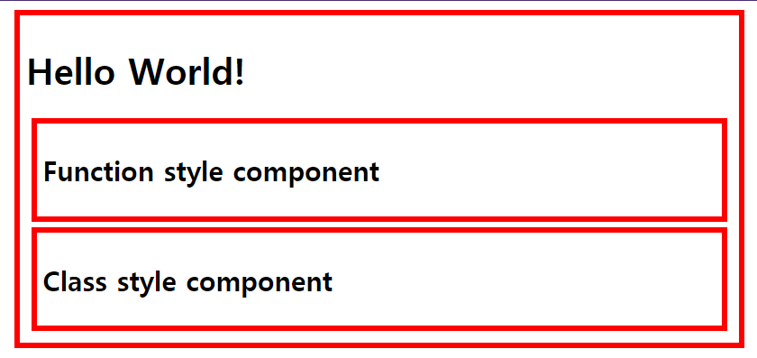

## 3. Class Component와 Function Component에서의 `props` 사용

```react
import React from 'react';
import './App.css';

function App() {
  return (
    <div className="container">
      <h1>Hello World!</h1>
      <FuncComp initNumber={2}></FuncComp>
      <ClassComp initNumber={2}></ClassComp>
    </div>
  );
}
// props를 함수에 인자로 넣어주고, props.initNumber로 받아올 수 있다.
function FuncComp(props) {
  return (
    <div className="container">
      <h2>Function style component</h2>
      <p>Number : {props.initNumber}</p>
    </div>
  );
}

class ClassComp extends React.Component {
  render() {
    return (
      <div className="container">
        <h2>Class style component</h2>
        <!-- 함수처럼 인자를 받아올 필요 없이 this.props.initNumber로 받아올 수 있다. -->
        <p>Number : {this.props.initNumber}</p>
      </div>
    )
  }
}

export default App;
```

## 4. Class Component: `state` 사용법

- 클래스 컴포넌트에서는 `props`를 `state`로 받아와서 `setState()` 메소드를 이용하여 `state`값을 변경할 수 있다.
- `state`값이 변경될 때마다 클래스 컴포넌트 내부의 `render()`함수가 호출되어 매번 리렌더링된다.

```react
class ClassComp extends React.Component {
  // props를 state로 받아온다.
  state = {
    number:this.props.initNumber
  }
  render() {
    return (
      <div className="container">
        <h2>Class style component</h2>
        <p>Number : {this.state.number}</p>
        <!-- 버튼을 클릭할 때마다 값이 랜덤으로 바뀌는 함수를 사용해서 setState()로 state값을 변경해준다. -->
        <input type="button" value="random" onClick= {
          function() {
            this.setState({number:Math.random()})
          }.bind(this)
        }></input>
      </div>
    )
  }
}
```

## 5. Function Component: `hooks`로 `state`사용법

- 함수형 컴포넌트에서 `props`를 `state`로 받아와서 사용하기 위해서는 `useState()`를 사용한다.
- `useState()`
  - `React.useState()`로 작성 또는 `import { useState } from 'react';`로 임포트하여 `useState()`로 작성하여 사용
  - 2개의 값을 가진 배열을 리턴한다.
  - 0번째 데이터: 현재의 `state`값
  - 1번째 데이터: 새로 변경할 `state`값을 넣어줄 곳

```react
import React, {useState} from 'react';
import './App.css';

function App() {
  return (
    <div className="container">
      <h1>Hello World!</h1>
      <FuncComp initNumber={2}></FuncComp>
      <ClassComp initNumber={2}></ClassComp>
    </div>
  );
}

function FuncComp(props) {
  // React의 useState에서 state의 초기값(props.initNumber)을 인자로 넣어주면
  var numberState = useState(props.initNumber);
  // useState() 배열의 0번째 값에 현재의 state(initNumber)값이 들어간다.
  var number = numberState[0];
  // class component의 setState처럼 상태를 바꾸려면 배열의 1번째 데이터를 바꾼다.
  var setNumber = numberState[1];

  // var dateState = useState((new Date()).toString());
  // var _date = dateState[0];
  // var setDate = dateState[1];
  // 바로 위 3줄로 나눠서 쓴 것과 똑같이 동작하는 축약형 코드
  var [_date, setDate] = useState((new Date()).toString());

  // useState()를 쓰면 무조건 2개의 값으로 이루어진 배열이 리턴됨
  console.log('numberState', numberState);
  return (
    <div className="container">
      <h2>Function style component</h2>
      <p>Number : {number}</p>
      <p>Date : {_date}</p>
      <input type="button" value="random" onClick={
        function() {
          setNumber(Math.random());
        }
      }></input>
      <input type="button" value="date" onClick={
        function() {
          setDate((new Date()).toString());
        }
      }></input>
    </div>
  );
}
```

- 위의 함수형 컴포넌트에서 만든 것과 동일하게 작동하도록 만든 클래스 컴포넌트

```react
class ClassComp extends React.Component {
  state = {
    number:this.props.initNumber,
    date:(new Date()).toString()
  }
  render() {
    return (
      <div className="container">
        <h2>Class style component</h2>
        <p>Number : {this.state.number}</p>
        <p>Date : {this.state.date}</p>
        <input type="button" value="random" onClick= {
          function() {
            this.setState({number:Math.random()})
          }.bind(this)
        }></input>
        <input type="button" value="date" onClick= {
          function() {
            this.setState({date:(new Date()).toString()})
          }.bind(this)
        }></input>
      </div>
    )
  }
}
```

- 화면 출력

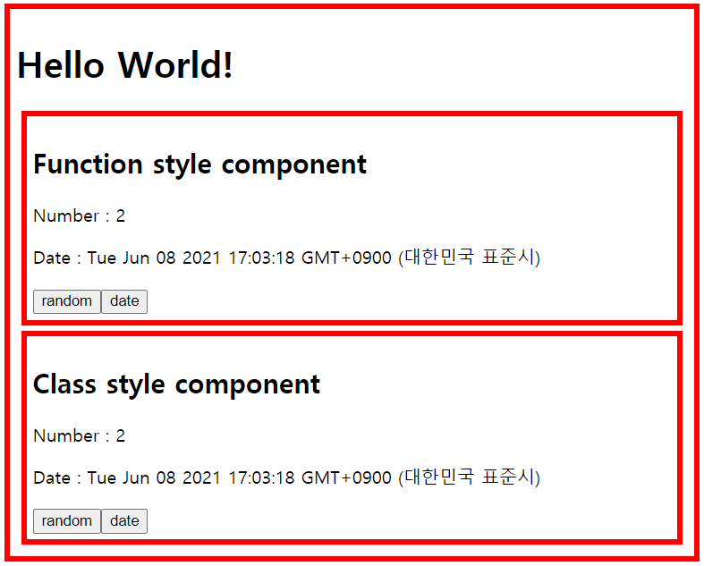

## 6. Class Component: Life-cycle 구현

- 클래스형 컴포넌트의 라이프 사이클(기본)

  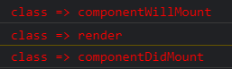

  1. `componentWillMount`
  2. `render`
  3. `componentDidMount`

- 클래스형 컴포넌트의 라이프 사이클(확장)

  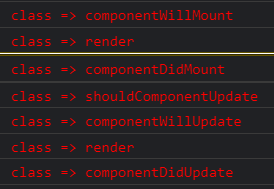

  1. `componentWillMount`
  2. `render`
  3. `componentDidMount`

  ❗ 화면에 출력할 값이 변경되는 이벤트 동작 후

  1. `shouldComponentUpdate`
  2. `componentWillUpdate`
  3. `render`
  4. `componentDidUpdate`

- 클래스형 컴포넌트 코드

```react
var classStyle = 'color:red';
class ClassComp extends React.Component {
  state = {
    number:this.props.initNumber,
    date:(new Date()).toString()
  }
  componentWillMount() {
    console.log('%cclass => componentWillMount',classStyle);
  }
  componentDidMount() {
    console.log('%cclass => componentDidMount',classStyle);
  }
  shouldComponentUpdate(nextProps, nextState) {
    console.log('%cclass => shouldComponentUpdate',classStyle);
    return true;
  }
  componentWillUpdate(nextProps, nextState) {
    console.log('%cclass => componentWillUpdate',classStyle);
  }
  componentDidUpdate(nextProps, nextState) {
    console.log('%cclass => componentDidUpdate',classStyle);
  }
  render() {
    console.log('%cclass => render',classStyle);
    return (
      <div className="container">
        <h2>Class style component</h2>
        <p>Number : {this.state.number}</p>
        <p>Date : {this.state.date}</p>
        <input type="button" value="random" onClick= {
          function() {
            this.setState({number:Math.random()})
          }.bind(this)
        }></input>
        <input type="button" value="date" onClick= {
          function() {
            this.setState({date:(new Date()).toString()})
          }.bind(this)
        }></input>
      </div>
    )
  }
}
```

## 7. Function Component: Life-cycle 구현

### 7-1. useEffect

> 함수형 컴포넌트에서 클래스형 컴포넌트의 componentDidMount, comeponentDidUpdate와 같은 역할. 사용하려면 import를 해야 한다.

- useEffect의 effect는 side effect라는 뜻이다.
- Main effect는 return() 안에 작성한 화면 렌더링이며, side effect(useEffect)는 이미 렌더링된 후에 값을 변경하는 것이다.
- useEffect는 한 번에 여러 개 설치가 가능하다.

### 7-2. 클래스형 컴포넌트와 함수형 컴포넌트의 라이프 사이클 비교

- 클래스형 컴포넌트의 componenetDidMount와 함수형 컴포넌트의 useEffect

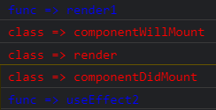

- 함수형 컴포넌트의 useEffect와 render 순서


- 함수형 컴포넌트와 클래스형 컴포넌트의 라이프 사이클

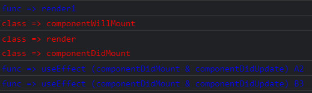

- 함수형 컴포넌트 코드

```react
var funcStyle = 'color:blue';
var funcId = 0;
function FuncComp(props) {
  // React의 useState에서 state의 초기값(props.initNumber)을 인자로 넣어주면
  var numberState = useState(props.initNumber);
  // useState() 배열의 0번째 값에 현재의 state(initNumber)값이 들어간다.
  var number = numberState[0];
  // class component의 setState처럼 상태를 바꾸려면 배열의 1번째 데이터를 바꾼다.
  var setNumber = numberState[1];

  // var dateState = useState((new Date()).toString());
  // var _date = dateState[0];
  // var setDate = dateState[1];
  // 바로 위 3줄로 나눠서 쓴 것과 똑같이 동작하는 축약형 코드
  var [_date, setDate] = useState((new Date()).toString());

  // 함수형 컴포넌트에서 useEffect는 클래스형 컴포넌트의 componentDidMount, componentDidUpdate와 같은 역할
  // useEffect의 effect는 side effect
  // Main effect는 return() 안에 작성한 화면 렌더링
  // side effect(useEffect)는 이미 렌더링된 후에 값을 변경하는 것
  // useEffect는 여러 개 설치 가능
  useEffect(function() {
    console.log('%cfunc => useEffect (componentDidMount & componentDidUpdate) A' + (++funcId), funcStyle);
    document.title = number + ' : ' + _date;
  });
  useEffect(function() {
    console.log('%cfunc => useEffect (componentDidMount & componentDidUpdate) B' + (++funcId), funcStyle);
    document.title = number + ' : ' + _date;
  });

  // useState()를 쓰면 무조건 2개의 값으로 이루어진 배열이 리턴됨
  // console.log('numberState', numberState);
  console.log('%cfunc => render' + (++funcId), funcStyle);
  return (
    <div className="container">
      <h2>Function style component</h2>
      <p>Number : {number}</p>
      <p>Date : {_date}</p>
      <input type="button" value="random" onClick={
        function() {
          setNumber(Math.random());
        }
      }></input>
      <input type="button" value="date" onClick={
        function() {
          setDate((new Date()).toString());
        }
      }></input>
    </div>
  );
}
```

### 7-3. clean-up

>  useEffect가 한번 실행된 후 다시 실행될 때 이전에 실행했던 값을 정리해주는 것

- `useEffect()`에서 파라미터로 넣은 함수의 `return`값이다.
- 클래스형 컴포넌트에서는 `componentDidMount`에서 어떤 설정을 한 뒤 `componentWillUnmount`에서 이를 정리(clean-up)하는데, 이와 같이 함수형 컴포넌트에서는 어떤 `effect`가 실행되고 다음 `effect`가 실행되기 직전에 정리(clean-up)를 해준다.
- 함수형 컴포넌트에서 `clean-up`이 실행될 때의 라이프 사이클
  - `render` ➡ `useEffect` 사용 1 ➡ `re-render` ➡ `clean-up` ➡ `useEffect` 사용 2

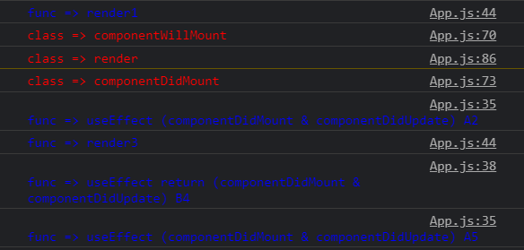

- 함수형 컴포넌트 코드

```react
var funcStyle = 'color:blue';
var funcId = 0;
function FuncComp(props) {
  // React의 useState에서 state의 초기값(props.initNumber)을 인자로 넣어주면
  var numberState = useState(props.initNumber);
  // useState() 배열의 0번째 값에 현재의 state(initNumber)값이 들어간다.
  var number = numberState[0];
  // class component의 setState처럼 상태를 바꾸려면 배열의 1번째 데이터를 바꾼다.
  var setNumber = numberState[1];

  // var dateState = useState((new Date()).toString());
  // var _date = dateState[0];
  // var setDate = dateState[1];
  // 바로 위 3줄로 나눠서 쓴 것과 똑같이 동작하는 축약형 코드
  var [_date, setDate] = useState((new Date()).toString());

  // 함수형 컴포넌트에서 useEffect는 클래스형 컴포넌트의 componentDidMount, componentDidUpdate와 같은 역할
  // useEffect의 effect는 side effect
  // Main effect는 return() 안에 작성한 화면 렌더링
  // side effect(useEffect)는 이미 렌더링된 후에 값을 변경하는 것
  // useEffect는 여러 개 설치 가능
  useEffect(function() {
    console.log('%cfunc => useEffect (componentDidMount & componentDidUpdate) A' + (++funcId), funcStyle);
    document.title = number + ' : ' + _date;
    // useEffect가 한번 실행된 후 다시 실행될 때 이전에 실행했던 값을 정리해주는 것이 clean up
    // 예를 들면 입장할 때 구독하고 퇴장할 때 구독취소를 하는 것
    return function() {
      console.log('%cfunc => useEffect return (componentDidMount & componentDidUpdate) B' + (++funcId), funcStyle);
    }
  });
  // useState()를 쓰면 무조건 2개의 값으로 이루어진 배열이 리턴됨
  // console.log('numberState', numberState);
  console.log('%cfunc => render' + (++funcId), funcStyle);
  return (
    <div className="container">
      <h2>Function style component</h2>
      <p>Number : {number}</p>
      <p>Date : {_date}</p>
      <input type="button" value="random" onClick={
        function() {
          setNumber(Math.random());
        }
      }></input>
      <input type="button" value="date" onClick={
        function() {
          setDate((new Date()).toString());
        }
      }></input>
    </div>
  );
}
```

### 7-4. Skipping Effects

> 변경된 `props`나 `state`값이 있을 때만 변경된 값으로 `effect`를 실행해서 성능을 최적화할 수 있다.

- 클래스형 컴포넌트가 `componentDidUpdate`에서 `prevProps`나 `prevState`와 현재 값을 비교하여 현재 값이 바뀌었을 때만 업데이트를 하여 리렌더링하는 것처럼 함수형 컴포넌트에서도 `effect`의 실행 여부를 판단해서 성능을 최적화할 수 있다.
- `useEffect()`에 이전 값과 현재 값을 비교할 인자를 하나 더 넣어주면 된다.
- `number`와 `_date`를 각각 `useEffect()`를 사용해서 업데이트할 때 라이프 사이클

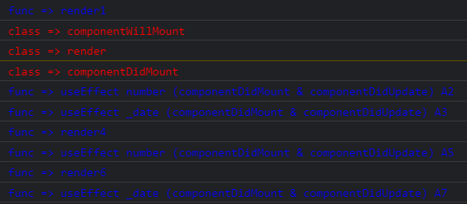

- 각 `useEffect()`에 `clean-up`을 적용했을 때 라이프 사이클

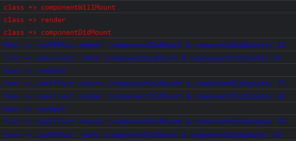

- `useEffect (componentDidMount)`를 적용했을 때 라이프 사이클
  - `useEffect`를 최초에 한 번만 실행해서 `componentDidMount`와 같은 역할을 하게 할 때는 인자로 빈 배열을 넣어준다.
  - 이 `effect`가 `clean-up(unmount)`되는 때는 부모 컴포넌트에서 이 함수형 컴포넌트를 삭제하게 될 때이다.

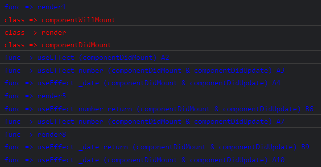

- 함수형 컴포넌트 코드

```react
var funcStyle = 'color:blue';
var funcId = 0;
function FuncComp(props) {
  // React의 useState에서 state의 초기값(props.initNumber)을 인자로 넣어주면
  var numberState = useState(props.initNumber);
  // useState() 배열의 0번째 값에 현재의 state(initNumber)값이 들어간다.
  var number = numberState[0];
  // class component의 setState처럼 상태를 바꾸려면 배열의 1번째 데이터를 바꾼다.
  var setNumber = numberState[1];

  // var dateState = useState((new Date()).toString());
  // var _date = dateState[0];
  // var setDate = dateState[1];
  // 바로 위 3줄로 나눠서 쓴 것과 똑같이 동작하는 축약형 코드
  var [_date, setDate] = useState((new Date()).toString());

  // 함수형 컴포넌트에서 useEffect는 클래스형 컴포넌트의 componentDidMount, componentDidUpdate와 같은 역할
  // useEffect의 effect는 side effect
  // Main effect는 return() 안에 작성한 화면 렌더링
  // side effect(useEffect)는 이미 렌더링된 후에 값을 변경하는 것
  // useEffect는 여러 개 설치 가능
  useEffect(function() {
    console.log('%cfunc => useEffect (componentDidMount) A' + (++funcId), funcStyle);
    document.title = number;
    // useEffect가 한번 실행된 후 다시 실행될 때 이전에 실행했던 값을 정리해주는 것이 clean up
    // 예를 들면 입장할 때 구독하고 퇴장할 때 구독취소를 하는 것
    // 이 effect는 부모 컴포넌트에서 이 함수 컴포넌트를 삭제하는 경우에 clean-up(unmount)을 하게 된다.
    return function() {
      console.log('%cfunc => useEffect return (componentWillUnmount) B' + (++funcId), funcStyle);
    }
  // 빈 배열을 넣으면 처음 한 번만 실행되고 그 후로는 실행되지 않는다.(componentDidMount만 하도록)
  }, []);

  useEffect(function() {
    console.log('%cfunc => useEffect number (componentDidMount & componentDidUpdate) A' + (++funcId), funcStyle);
    document.title = number;
    // useEffect가 한번 실행된 후 다시 실행될 때 이전에 실행했던 값을 정리해주는 것이 clean up
    // 예를 들면 입장할 때 구독하고 퇴장할 때 구독취소를 하는 것
    return function() {
      console.log('%cfunc => useEffect number return (componentDidMount & componentDidUpdate) B' + (++funcId), funcStyle);
    }
    // number만 변경된 것을 감지
  }, [number]);

  useEffect(function() {
    console.log('%cfunc => useEffect _date (componentDidMount & componentDidUpdate) A' + (++funcId), funcStyle);
    document.title = _date;
    // useEffect가 한번 실행된 후 다시 실행될 때 이전에 실행했던 값을 정리해주는 것이 clean up
    // 예를 들면 입장할 때 구독하고 퇴장할 때 구독취소를 하는 것
    return function() {
      console.log('%cfunc => useEffect _date return (componentDidMount & componentDidUpdate) B' + (++funcId), funcStyle);
    }
    // _date만 변경된 것을 감지
  }, [_date]);

  // useState()를 쓰면 무조건 2개의 값으로 이루어진 배열이 리턴됨
  // console.log('numberState', numberState);
  console.log('%cfunc => render' + (++funcId), funcStyle);
  return (
    <div className="container">
      <h2>Function style component</h2>
      <p>Number : {number}</p>
      <p>Date : {_date}</p>
      <input type="button" value="random" onClick={
        function() {
          setNumber(Math.random());
        }
      }></input>
      <input type="button" value="date" onClick={
        function() {
          setDate((new Date()).toString());
        }
      }></input>
    </div>
  );
}
```

## 8. 마무리

### 8-1. setState로 클래스형 컴포넌트와 함수형 컴포넌트 각각 숨기기

- 구현 코드

```react
import React, {useState, useEffect} from 'react';
import './App.css';

function App() {
  // 함수형 컴포넌트와 클래스형 컴포넌트 숨기는 버튼 만들기
  // 기본적으로 보이게 할 것이므로 true값을 준다.
  var [funcShow, setFuncShow] = useState(true);
  var [classShow, setClassShow] = useState(true);
  return (
    <div className="container">
      <h1>Hello World!</h1>
      <input type="button" value="remove func" onClick={function() {
        setFuncShow(false);
      }}></input>
      <input type="button" value="remove class" onClick={function() {
        setClassShow(false);
      }}></input>
      {funcShow ? <FuncComp initNumber={2}></FuncComp> : null}
      {classShow ? <ClassComp initNumber={2}></ClassComp> : null}
    </div>
  );
}
var funcStyle = 'color:blue';
var funcId = 0;
function FuncComp(props) {
  // React의 useState에서 state의 초기값(props.initNumber)을 인자로 넣어주면
  var numberState = useState(props.initNumber);
  // useState() 배열의 0번째 값에 현재의 state(initNumber)값이 들어간다.
  var number = numberState[0];
  // class component의 setState처럼 상태를 바꾸려면 배열의 1번째 데이터를 바꾼다.
  var setNumber = numberState[1];

  // var dateState = useState((new Date()).toString());
  // var _date = dateState[0];
  // var setDate = dateState[1];
  // 바로 위 3줄로 나눠서 쓴 것과 똑같이 동작하는 축약형 코드
  var [_date, setDate] = useState((new Date()).toString());

  // 함수형 컴포넌트에서 useEffect는 클래스형 컴포넌트의 componentDidMount, componentDidUpdate와 같은 역할
  // useEffect의 effect는 side effect
  // Main effect는 return() 안에 작성한 화면 렌더링
  // side effect(useEffect)는 이미 렌더링된 후에 값을 변경하는 것
  // useEffect는 여러 개 설치 가능
  useEffect(function() {
    console.log('%cfunc => useEffect (componentDidMount) A' + (++funcId), funcStyle);
    document.title = number;
    // useEffect가 한번 실행된 후 다시 실행될 때 이전에 실행했던 값을 정리해주는 것이 clean up
    // 예를 들면 입장할 때 구독하고 퇴장할 때 구독취소를 하는 것
    // 이 effect는 부모 컴포넌트에서 이 함수 컴포넌트를 삭제하는 경우에 clean-up(unmount)을 하게 된다.
    return function() {
      console.log('%cfunc => useEffect return (componentWillUnmount) B' + (++funcId), funcStyle);
    }
  // 빈 배열을 넣으면 처음 한 번만 실행되고 그 후로는 실행되지 않는다.(componentDidMount만 하도록)
  }, []);

  useEffect(function() {
    console.log('%cfunc => useEffect number (componentDidMount & componentDidUpdate) A' + (++funcId), funcStyle);
    document.title = number;
    // useEffect가 한번 실행된 후 다시 실행될 때 이전에 실행했던 값을 정리해주는 것이 clean up
    // 예를 들면 입장할 때 구독하고 퇴장할 때 구독취소를 하는 것
    return function() {
      console.log('%cfunc => useEffect number return (componentDidMount & componentDidUpdate) B' + (++funcId), funcStyle);
    }
    // number만 변경된 것을 감지
  }, [number]);

  useEffect(function() {
    console.log('%cfunc => useEffect _date (componentDidMount & componentDidUpdate) A' + (++funcId), funcStyle);
    document.title = _date;
    // useEffect가 한번 실행된 후 다시 실행될 때 이전에 실행했던 값을 정리해주는 것이 clean up
    // 예를 들면 입장할 때 구독하고 퇴장할 때 구독취소를 하는 것
    return function() {
      console.log('%cfunc => useEffect _date return (componentDidMount & componentDidUpdate) B' + (++funcId), funcStyle);
    }
    // _date만 변경된 것을 감지
  }, [_date]);

  // useState()를 쓰면 무조건 2개의 값으로 이루어진 배열이 리턴됨
  // console.log('numberState', numberState);
  console.log('%cfunc => render' + (++funcId), funcStyle);
  return (
    <div className="container">
      <h2>Function style component</h2>
      <p>Number : {number}</p>
      <p>Date : {_date}</p>
      <input type="button" value="random" onClick={
        function() {
          setNumber(Math.random());
        }
      }></input>
      <input type="button" value="date" onClick={
        function() {
          setDate((new Date()).toString());
        }
      }></input>
    </div>
  );
}
var classStyle = 'color:red';
class ClassComp extends React.Component {
  state = {
    number:this.props.initNumber,
    date:(new Date()).toString()
  }
  componentWillMount() {
    console.log('%cclass => componentWillMount',classStyle);
  }
  componentDidMount() {
    console.log('%cclass => componentDidMount',classStyle);
  }
  shouldComponentUpdate(nextProps, nextState) {
    console.log('%cclass => shouldComponentUpdate',classStyle);
    return true;
  }
  componentWillUpdate(nextProps, nextState) {
    console.log('%cclass => componentWillUpdate',classStyle);
  }
  componentDidUpdate(nextProps, nextState) {
    console.log('%cclass => componentDidUpdate',classStyle);
  }
  componentWillUnmount() {
    console.log('%cclass => componentWillUnmount',classStyle);
  }
  render() {
    console.log('%cclass => render',classStyle);
    return (
      <div className="container">
        <h2>Class style component</h2>
        <p>Number : {this.state.number}</p>
        <p>Date : {this.state.date}</p>
        <input type="button" value="random" onClick= {
          function() {
            this.setState({number:Math.random()})
          }.bind(this)
        }></input>
        <input type="button" value="date" onClick= {
          function() {
            this.setState({date:(new Date()).toString()})
          }.bind(this)
        }></input>
      </div>
    )
  }
}

export default App;
```

- 함수형 컴포넌트를 숨겼을 때 라이프 사이클

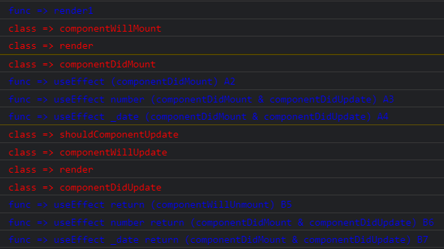

- 클래스형 컴포넌트를 숨겼을 때 라이프 사이클

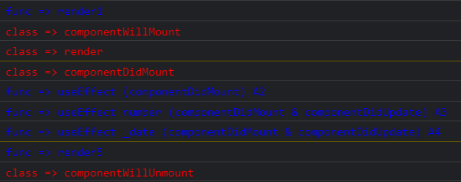


